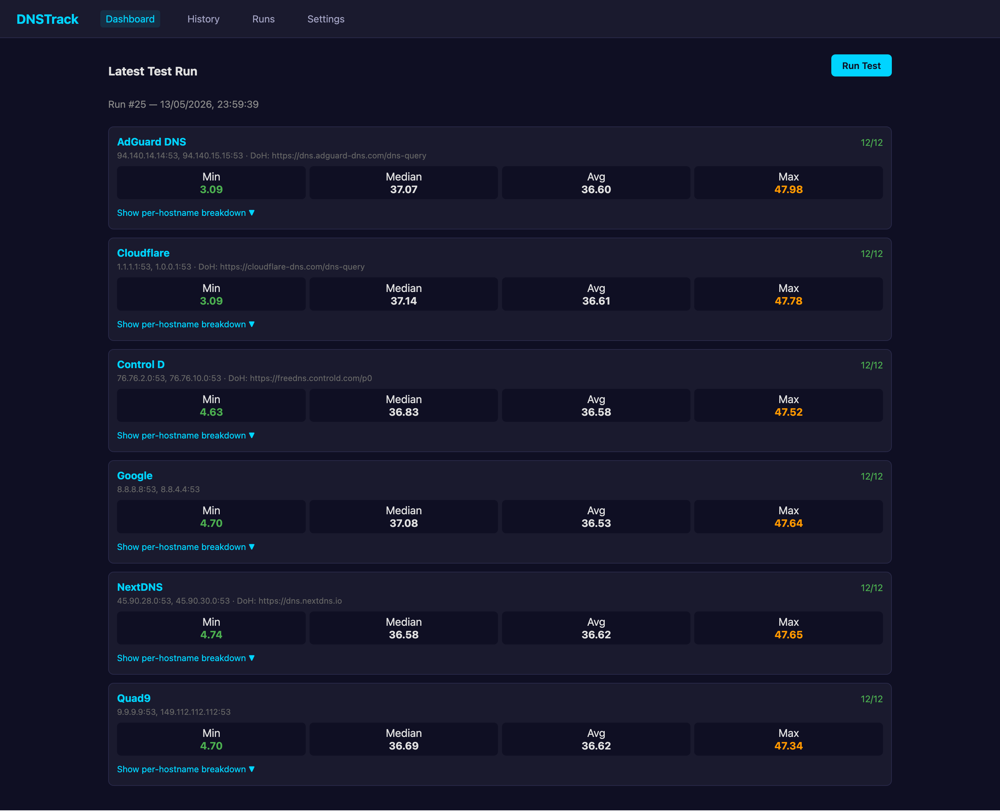

# dns-track

Self-hosted DNS speed tracker. Monitors DNS resolution times across multiple providers and visualizes performance over time.



## Supported DNS Protocols

- UDP on port 53

More protocols (DoH, DoT) can be added — the architecture is designed for easy extension.

## Quick Start (Docker)

```bash
# Clone and run
git clone https://github.com/joe/dnstrack.git
cd dnstrack
docker compose up -d
```

Open `http://localhost:8080`

## Quick Start (Without Docker)

Requires Go 1.24+

```bash
go build -o dnstrack ./cmd/dnstrack/
./dnstrack
```

## Configuration

Edit `config.yaml` to customize providers, domains, and schedule:

```yaml
server:
  port: 8080

schedule:
  interval: "5m"        # How often to run tests
  retention_days: 90    # Auto-delete results older than this

domains:
  - google.com
  - github.com
  # ... add any domains

providers:
  - name: Custom DNS
    ips:
      - 192.168.1.1:53
    type: udp
    doh_url: https://example.com/dns-query   # optional
```

To add a new DNS provider, add an entry to the `providers` list and restart.

## API Endpoints

| Method | Path | Description |
|--------|------|-------------|
| GET | `/api/runs/latest` | Latest test run with per-provider stats and per-hostname breakdown |
| GET | `/api/runs/:id` | Specific run detail |
| GET | `/api/runs?limit=50` | List recent runs |
| GET | `/api/history?provider=X&hours=24` | Time-series data for charting |
| GET | `/api/providers` | List configured providers |
| POST | `/api/test` | Trigger an immediate test run |

## Architecture

- **Backend**: Go (chi router, miekg/dns, robfig/cron, modernc SQLite)
- **Frontend**: Single-page HTML with Chart.js
- **Database**: SQLite (auto-managed, 90-day retention)
- **Deployment**: Single binary, Docker
